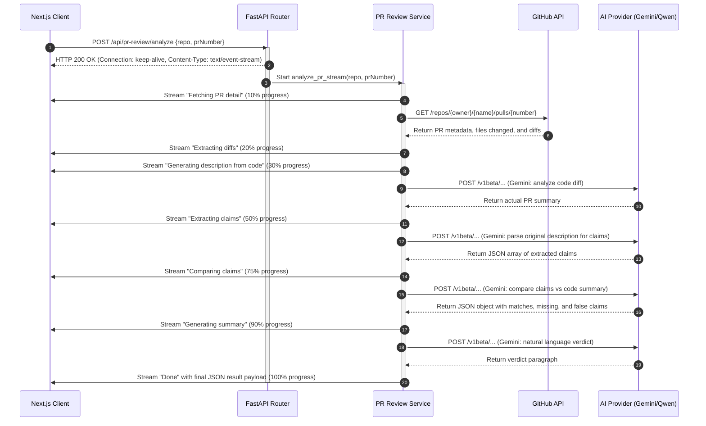

# SlopScanning: System Architecture Specification

**Author:** thanos · **Repository:** [beginningofcoding/slopscanning](https://github.com/beginningofcoding/slopscanning)

This document provides a comprehensive technical reference for the architecture, request lifecycles, processing pipelines, and local utility modules of the **SlopScanning** AI-driven code auditing and slop detection system.

---

## 🗺️ System Architecture Map

SlopScanning is built upon a high-performance **asynchronous, direct-streaming architecture** using FastAPI, Next.js, and Server-Sent Events (SSE). Unlike traditional batch-based scanning systems that require heavy background worker polling, SlopScanning negotiates real-time SSE streams to return progressive analysis results directly to the user over a single connection.

```
┌─────────────────────────────────────────────────────────────────────────┐
│                           CLIENT (Browser)                              │
│              Next.js App Router  |  Tailwind v4  |  Google Sans         │
└────────────────────────────────────┬────────────────────────────────────┘
                                     │ HTTPS / SSE
                                     ▼
┌─────────────────────────────────────────────────────────────────────────┐
│                       Nginx (Reverse Proxy - Prod)                      │
│             SSL termination  |  rate limiting  |  routing               │
└──────────┬──────────────────────────────────────────────────────────────┘
           │
           ▼
┌─────────────────────────────────────────────────────────────────────────┐
│                    FastAPI Web Server (Port 8000)                       │
│        Uvicorn  |  Asyncio  |  SSE Direct Streaming Handlers            │
└───────┬──────────────┬───────────────┬──────────────────────────────────┘
        │              │               │
        ▼              ▼               ▼
 ┌──────────────┐ ┌──────────┐ ┌────────────────┐
 │  Redis       │ │  Temp    │ │   Regex        │
 │  Cache       │ │  Sandbox │ │   Heuristics   │
 └──────────────┘ └──────────┘ └────────────────┘
```

### Architectural Pillars
1. **Asynchronous Execution Loop**: The FastAPI backend is built entirely on python's `asyncio` loop. Heavy operations (such as filesystem access, regex evaluation on directories, and external LLM invocations) are processed concurrently or offloaded to threads using `asyncio.to_thread` to ensure zero blocking of the server's event loop.
2. **Server-Sent Events (SSE)**: Long-running pipelines establish a persistent HTTP connection using a `StreamingResponse` set to `text/event-stream`. The client (Next.js) reads this stream progressively using a custom `useSsePostStream` hook, enabling sub-second latency for UI feedback.
3. **Multi-Model Orchestration**: Complex semantic tasks are split:
   * **Gemini 3.1 Flash-Lite** handles lightweight description generation, claims parsing, and HTML executive summaries.
   * **Qwen 2.5 72B Instruct** handles deep file parsing, claims verification against codebase contexts, and commit-diff auditing.
4. **Sandboxed Volatile Storage**: Codebase scanning clones repositories shallowly (`--depth 1`) inside a `tempfile.mkdtemp` sandbox. Scans are run, findings are aggregated, and the directory is cleaned up in a `finally` block, ensuring no disk leakage.

---

## 🔄 Request & Connection Lifecycles

SlopScanning relies on **direct-streaming HTTP requests** that output SSE data chunks. The lifecycle of a typical analysis run (e.g. PR Review) is detailed below:



---

## 🛠️ Feature Processing Pipelines

### 1. PR Reviewer
* **Input**: Repository URL (`owner/name`) and a target Pull Request number.
* **Validation**: Validates that the URL matches a standard GitHub pattern, and that the PR number is an integer.
* **Processing**:
  * Fetches the PR diff and description.
  * If the diff is larger than `80,000` characters, it is truncated to avoid LLM context token limits.
  * Prompts Gemini to generate a factual description of the diff.
  * Prompts Gemini to parse the user's PR description into discrete, testable claims.
  * Prompts Gemini to match the claims against the generated diff summary.
* **Response Generation**: Formulates verdicts (`TRUSTWORTHY`, `SUSPICIOUS`, `MISLEADING`), confidence scores, and flags representing missing or false claims.

### 2. Commit Reviewer
* **Input**: Repository URL and a scan limit count (default `10`).
* **Processing**:
  * Fetches the latest metadata for commits (SHA, author, message).
  * For each commit, pulls the associated diff patch via GitHub's raw diff headers.
  * Passes the commit message and diff to **Qwen 2.5 72B** to determine if the message is specific to the diff or generic/hallucinated.
  * Aggregates verdicts into an overall `slop_score` (representing the percentage of low-quality or fake logs) and `quality_score`.
* **Response**: Delivers the commit array alongside a comprehensive Gemini-generated report summarizing the team's logging hygiene.

### 3. Docs Verifier
* **Input**: Repository URL.
* **Processing**:
  * Clones the repository, walks the directories, and collects `.md` and `.mdx` files.
  * For each document, splits text into paragraphs.
  * Runs a placeholder detector (looking for bracket templates, lorem ipsum, unfinished TODOs).
  * Measures marketing fluff based on buzzword frequencies.
  * Computes paragraph Levenshtein similarity to find near-identical duplicates.
  * Extracts README feature claims and validates them against the codebase context using Fireworks (Gemini fallback).
* **Response**: Outputs file findings and a Markdown summary featuring styled HTML color tags to emphasize critical issues.

### 4. Code Scanner
* **Input**: Repository URL.
* **Processing**:
  * Clones the codebase.
  * Walks the tree and filters for code extensions (e.g. `.py`, `.js`, `.ts`, `.rs`).
  * Concurrently processes each file:
    * Scans for regex-based patterns (`regex_pattern_scorer.py`): Hardcoded secrets, placeholders, raw urls, fake successes.
    * Scores each match (skipping test files, lowering weights for example templates).
    * If a file exceeds `200` lines or contains regex candidates, submits it to OpenRouter for a deep static audit.
    * Applies a Semaphore of `15` concurrent requests to avoid OpenRouter rate-limiting.
* **Response**: Merges regex and LLM findings, groups them by file path, compiles repository-wide counts (`totalIssues`, `byType`, `bySeverity`), and returns the results.

---

## 🔒 Security & Verification

1. **GitHub Access Security**: Personal GitHub tokens (`GITHUB_TOKEN`) are configured strictly server-side and never exposed to the client.
2. **Volatile Sandboxing**: Shallow clones are written to temporary system paths (`tempfile.mkdtemp`) and are automatically deleted recursively (`shutil.rmtree`) upon completion or stream termination.
3. **CORS Safe-listing**: Production origins configured in `CORS_ORIGINS` are loaded alongside localhost for strict browser request filtering.
4. **Local Pattern Scoring**: Before pushing raw code snippets to external LLM services, the `regex_pattern_scorer.py` validates findings and filters benign declarations (like test cases, mock methods, and sample config files), preventing data-leakage of proprietary testing configurations.