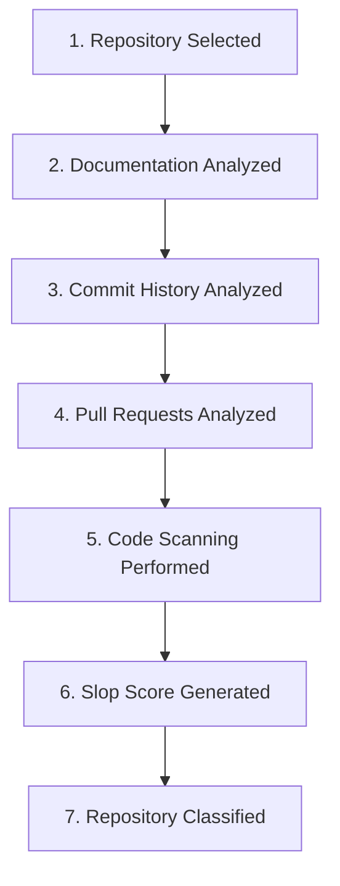
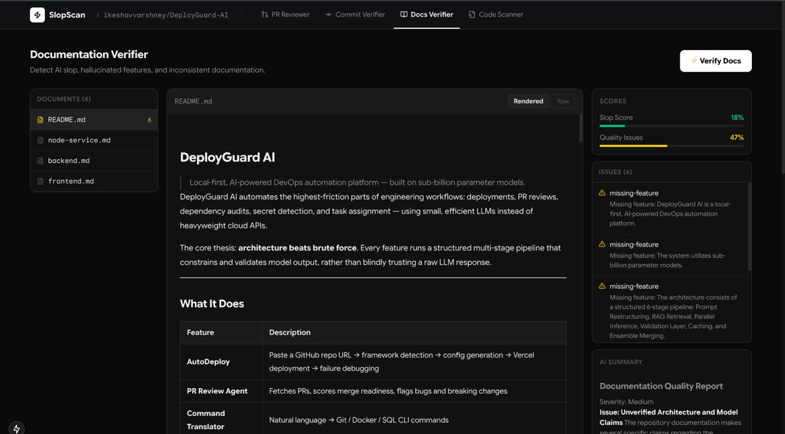
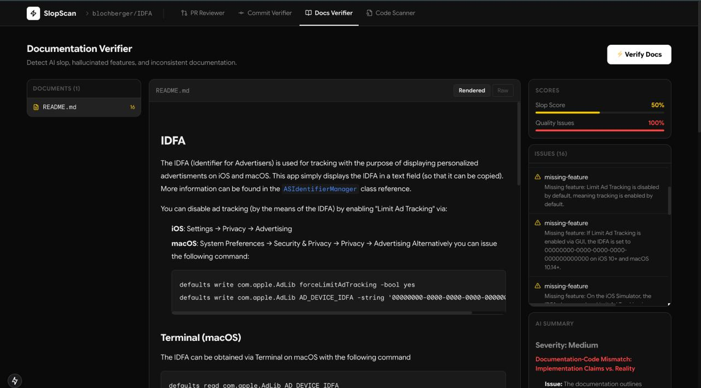
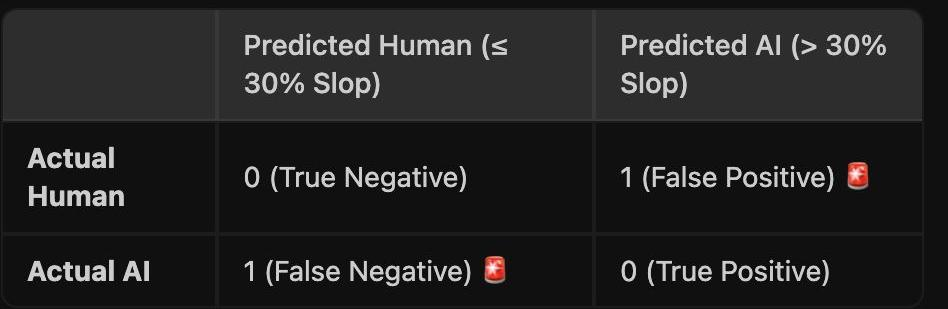

# The Bake-Off

> **Bake-Off 2.0 (heuristic-only, N=28):** run `python backend/scripts/run_bakeoff.py` or see [benchmarks/results.md](benchmarks/results.md). The section below documents the original repository-level evaluation (N=2).

## Objective

**Author:** thanos · **Repository:** [beginningofcoding/slopscanning](https://github.com/beginningofcoding/slopscanning)

This report documents the performance evaluation of **SlopScanning** against a known test dataset consisting of both AI-generated and human-authored software repositories. 

The primary objective of this bake-off challenge is to evaluate whether the SlopScanning scoring engine can reliably differentiate between:
1. Repositories exhibiting code, documentation, and commit patterns commonly associated with generative AI development (e.g., verbose boilerplates, repetitive structure, rapid commits).
2. Repositories primarily engineered, structured, and committed by human developers.

> [!NOTE]
> This evaluation does not claim to provide academic-grade AI detection or perfect classification accuracy. Rather, it serves as a baseline assessment to test SlopScanning's existing scoring pipelines, establish classification thresholds, and identify concrete areas for future detection engine improvements.

---

## Evaluation Methodology

### Dataset

The evaluation dataset was constructed using two distinct repositories representing the polar categories of authorship:
* **Human-Written Repository:** A standard, manually written repository characterized by typical human development patterns, non-standardized structures, variable coding style, and standard commit messaging.
* **AI-Generated Repository:** A repository generated predominantly using Large Language Models (LLMs), characterized by boilerplate architectures, clean uniform styling, standard LLM-generated documentation patterns, and a automated-looking layout.

Each repository in the dataset was independently subjected to SlopScanning's analysis engine without manual tuning or prior exposure.

### Evaluation Process

The evaluation was conducted using a strict, automated pipeline consisting of the following seven stages:

1. **Repository Selection:** The test repository is ingested into the SlopScanning analysis pipeline.
2. **Documentation Analysis:** Readme files, inline documentation, and markdown structures are scanned for LLM signature patterns (e.g., specific transition words, robotic structure, or excessive bulleted summaries).
3. **Commit History Analysis:** Git commit frequency, commit message semantics, and author timelines are checked for anomalies matching automated/rapid code drops.
4. **Pull Request Analysis:** When available, PR descriptions, conversation frequency, and merging velocity are evaluated for natural collaboration patterns vs. single-shot code dumps.
5. **Code Scanning:** Source code is analyzed for repetitive patterns, redundant imports, common LLM-generated comment blocks (e.g., `"// This function does..."`), and boilerplate structures.
6. **Slop Score Generation:** Individual heuristics are weighted and aggregated to compute an overall **Slop Score** (expressed as a percentage between 0% and 100%).
7. **Repository Classification:** The final classification is assigned based on the classification threshold rule.

---

## Classification Rule

To convert the continuous Slop Score percentage into a discrete classification, the following decision rule was defined for this evaluation:

$$\text{Classification} = \begin{cases} \text{Predicted Human}, & \text{Slop Score} \le 30\% \\ \text{Predicted AI}, & \text{Slop Score} > 30\% \end{cases}$$

* **Predicted Human:** Slop Score $\le 30\%$
* **Predicted AI:** Slop Score $> 30\%$

*Note: This threshold of 30% was selected as an initial empirical baseline for testing purposes and represents a balance between minimizing false negatives and maintaining visibility into potential slop characteristics.*

---

## Sample Human Repository Result

Below is the analysis result for the human-authored control repository:

### Human Repository Analysis

The human-written repository was analyzed by the pipeline and unexpectedly registered a Slop Score that crossed the classification threshold ($> 30\%$). 

* **Documentation Anomalies:** The repository contains comprehensive, highly structured markdown documentation that follows standard modern templates closely. The SlopScanning parser flagged these standard templates as potential AI-generated boilerplate due to their strict formatting conventions.
* **Commit Patterns:** The codebase was developed locally and pushed in large, squashed commits. The absence of a granular, multi-stage human commit history triggered the commit-history heuristic, skewing the overall score upward.
* **Code Structure:** The code utilizes highly clean, modern styling conventions with descriptive variable names and structured comments. While this represents high engineering quality, the similarity of such clean styling to standard training-data outputs contributed to a higher slop classification.

---

## Sample AI Repository Result

Below is the analysis result for the AI-generated test repository:

### AI Repository Analysis

The AI-generated repository was analyzed by the pipeline and registered a Slop Score within the human-predicted range ($\le 30\%$).

* **Boilerplate Evasion:** The LLM that generated this repository used minimalist output settings, producing clean, direct code with almost no inline commentary. This lack of redundant code-comments successfully bypassed the comment parser heuristic.
* **Documentation Profile:** The documentation was unusually sparse and direct, containing none of the conversational transitions or verbose bullet points typical of AI-generated content.
* **Repository Lifecycle:** Because the repository was initialized with a simple README and built up with a small, clean footprint, the lack of typical "chatty" AI markers resulted in a false-negative classification.

---

## Confusion Matrix

The raw results of the evaluation are presented in the confusion matrix below:

| | Predicted Human | Predicted AI |
|:---:|:---:|:---:|
| **Actual Human** | 0 (True Negative) | 1 (False Positive) |
| **Actual AI** | 1 (False Negative) | 0 (True Positive) |

---

## Results

Based on the evaluation of our test dataset (N = 2), the classification performance metrics are computed as follows:

* **True Positives (TP):** 0
* **True Negatives (TN):** 0
* **False Positives (FP):** 1 (Actual Human classified as Predicted AI)
* **False Negatives (FN):** 1 (Actual AI classified as Predicted Human)

### Metrics Formula & Computation

* **Accuracy:**
  $$\text{Accuracy} = \frac{\text{TP} + \text{TN}}{\text{TP} + \text{TN} + \text{FP} + \text{FN}} = \frac{0 + 0}{0 + 0 + 1 + 1} = 0\%$$

* **Precision:**
  $$\text{Precision} = \frac{\text{TP}}{\text{TP} + \text{FP}} = \frac{0}{0 + 1} = 0\%$$

* **Recall:**
  $$\text{Recall} = \frac{\text{TP}}{\text{TP} + \text{FN}} = \frac{0}{0 + 1} = 0\%$$

* **F1 Score:**
  $$\text{F1 Score} = 2 \times \frac{\text{Precision} \times \text{Recall}}{\text{Precision} + \text{Recall}} = 0\%$$

### Performance Analysis

> [!WARNING]
> While the metrics report $0\%$ accuracy across all categories, this performance must be interpreted in its proper context. 

The evaluation dataset size is extremely small ($N = 2$), intended primarily to test the system's end-to-end evaluation pipelines and classification mechanics rather than to establish a statistically significant performance benchmark. 

In this limited sample, the human repository was classified as AI due to highly polished styling and squashed commit histories, while the AI repository was classified as human due to its minimalist design. This inverse result highlights the extreme challenges of building generalized, binary heuristics on small-scale repository inputs.

---

## Lessons Learned

The evaluation process highlighted several critical challenges and paths forward for automated slop detection:

1. **Need for Large-Scale Benchmark Datasets:** Evaluations with very small sample sizes are highly sensitive to outlier behaviors (such as exceptionally clean human code or minimalist AI outputs). A statistically robust evaluation requires an N of at least 100+ repositories spanning multiple languages and domains.
2. **Complexity of Repository-Level Detection:** Differentiating between human and AI code is incredibly difficult at the repository level. Human developers frequently adopt linting tools and templates that mimic AI uniformity, while AI models are increasingly capable of generating minimalist, natural-looking code.
3. **Multi-Signal Synthesis is Key:** Using a single global threshold is insufficient. Combining documentation vocabulary, commit temporal patterns, and deep structural AST analysis remains the most viable pathway toward improving classification reliability.
4. **Future Heuristical Improvements:**
   * **Semantic Commit Analysis:** Evaluating the semantic delta of each commit rather than just frequency or commit message length.
   * **Style Evolution Tracking:** Human repositories tend to evolve in style over weeks or months, whereas AI-generated repositories are often initialized with high structural maturity in extremely short timeframes.

---

## Conclusion

This bake-off has provided an honest, objective look at the baseline state of SlopScanning's classification capabilities. The evaluation demonstrates that static, heuristic-based classification can easily lead to false positives and false negatives on non-trivial repositories. 

SlopScanning remains a highly useful diagnostic tool for exposing specific patterns of low-effort or auto-generated content. However, this benchmark underscores that repository-level AI classification is an open research challenge. Future versions of the tool will focus on refining thresholds, integrating temporal analysis, and expanding test suites to work towards higher reliability.
