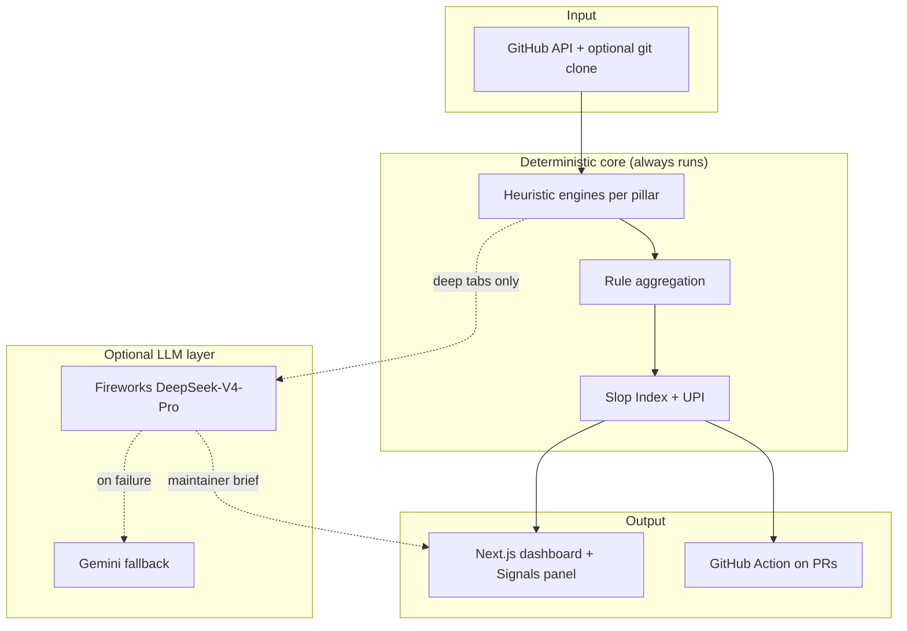
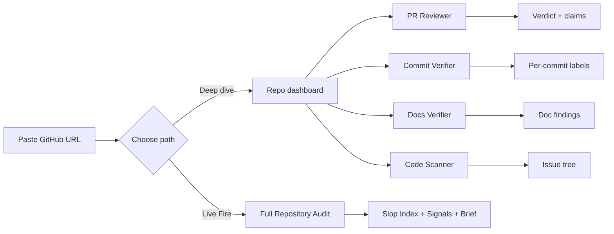
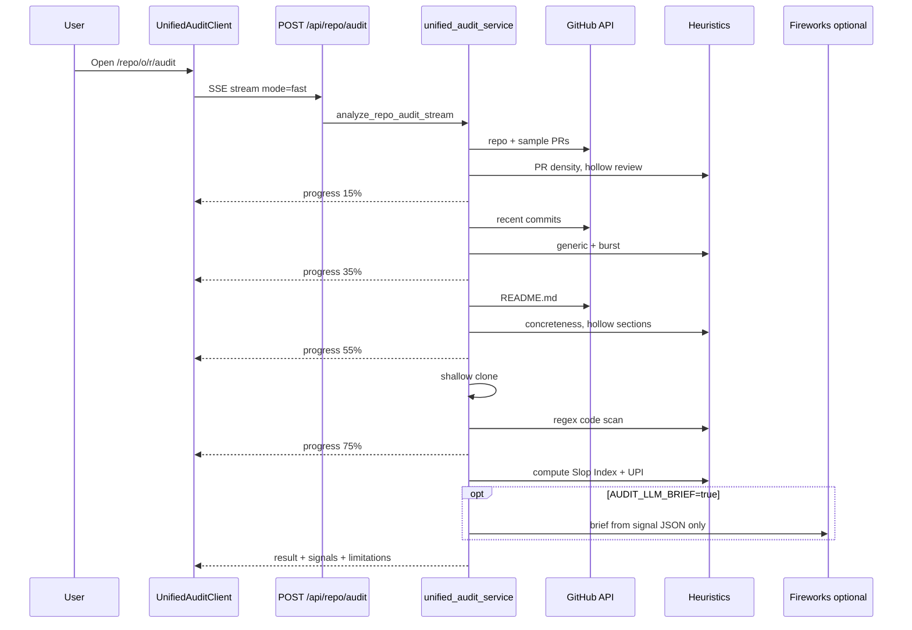
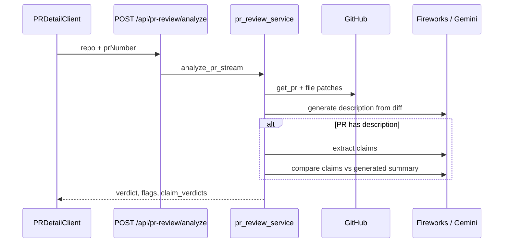
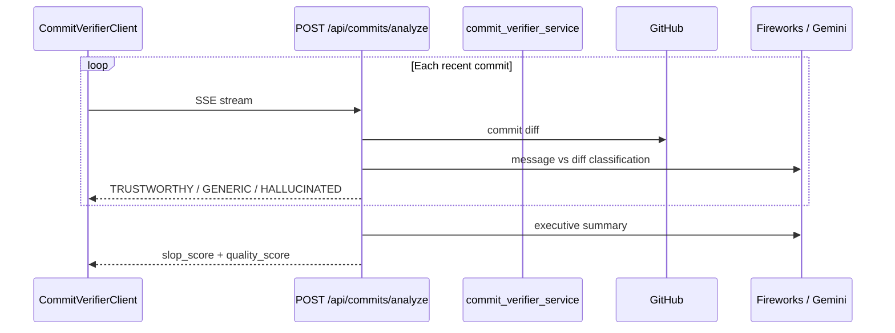
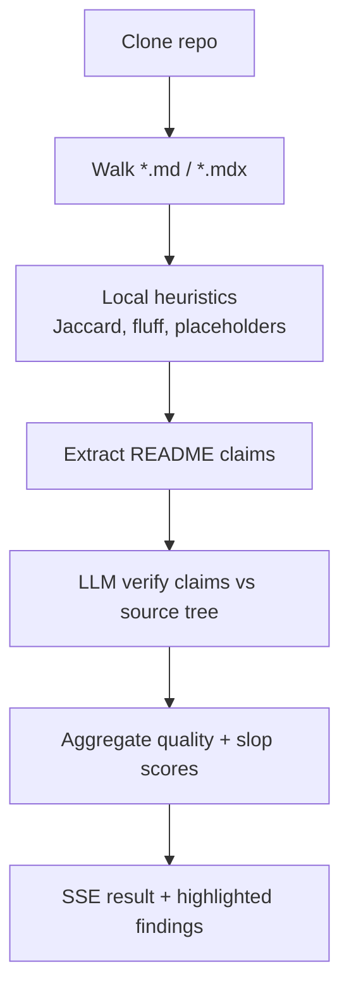
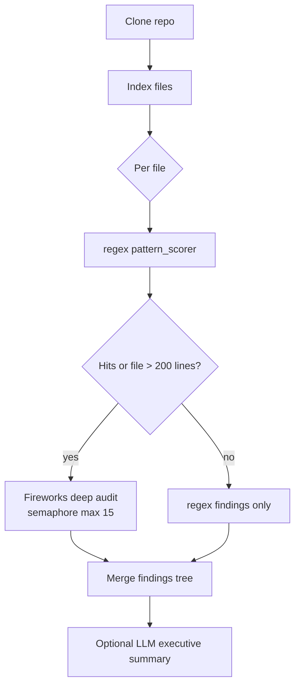
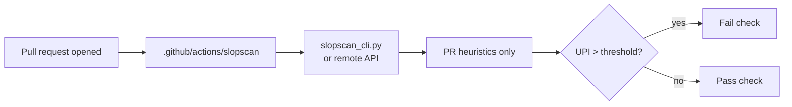
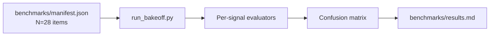
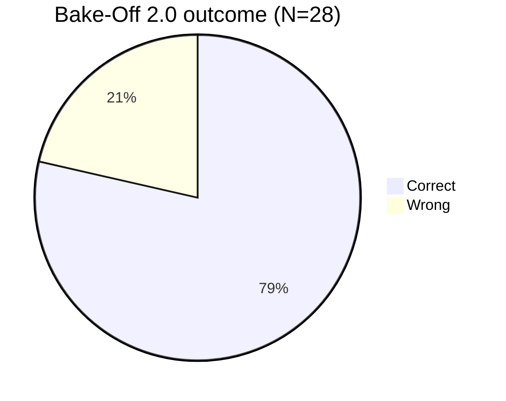

# SlopScanning

**Did a human actually check this before publish?**

SlopScanning is a zero-trust GitHub auditor built for the [**Slop Scan hackathon**](https://slopscan.ai) (72 hours · May 29 – Jun 1, 2026). It catches low-effort AI content in **pull requests, commits, documentation, and code**—before it wastes a reviewer’s time.

| | |
|---|---|
| **Author** | [thanos](https://github.com/beginningofcoding) |
| **Repository** | [beginningofcoding/slopscanning](https://github.com/beginningofcoding/slopscanning) |
| **Primary track** | **A — Code Review** |
| **Secondary track** | **B — Docs & KBs** |
| **License** | MIT |

---

## Table of contents

1. [Hackathon fit](#hackathon-fit)
2. [The problem we solve](#the-problem-we-solve)
3. [Our approach](#our-approach)
4. [Features](#features)
5. [System architecture](#system-architecture)
6. [Detection methodology](#detection-methodology)
7. [Workflows](#workflows)
8. [Evaluation & bake-offs](#evaluation--bake-offs)
9. [Tech stack](#tech-stack)
10. [Quick start](#quick-start)
11. [API overview](#api-overview)
12. [Bonus challenges](#bonus-challenges)
13. [Demo script (5 min)](#demo-script-5-min)
14. [Project structure](#project-structure)
15. [Limitations](#limitations)
16. [Further reading](#further-reading)

---

## Hackathon fit

The hackathon asks builders to answer one question:

> **Did a human actually check this before hitting publish?**

SlopScanning is not an “AI authorship detector.” It is an **evidence-based quality gate** for GitHub repos: deterministic heuristics first, optional LLM narration second—always tied to inspectable signals.

| Hackathon ask | How SlopScanning delivers |
|---------------|---------------------------|
| Detect hollow PRs / commit slop | PR density overlap, hollow reviews, generic commits, burst patterns |
| Score doc information density | Hollow sections, low concreteness, README vs manifest drift |
| Show real detection logic | [`DETECTION.md`](DETECTION.md), [`backend/heuristics/`](backend/heuristics/), open signal catalog |
| Honest metrics | [Bake-Off 2.0](#bake-off-20-heuristic-benchmark-n28) + transparent [Bake-Off 1.0](#bake-off-10-repository-pilot-n2) failures |
| Working tool | Next.js UI + FastAPI + SSE streaming + `docker compose up` |
| Live Fire demo | Homepage presets → **Full Repository Audit** (`/repo/owner/name/audit`) |

---

## The problem we solve

Generative AI makes it cheap to produce code, docs, and PR text that *looks* complete. Reviewers still burn time on:

- PR descriptions that **restate the diff** instead of explaining intent
- **“LGTM”** reviews on large, risky changes
- Commit messages like `fix bug` / `update index.js` with no link to the diff
- READMEs full of **marketing filler** and zero install commands
- Code with **stubs, hardcoded secrets, and fake success paths**

SlopScanning surfaces these patterns with **named signals**, pillar scores, and two composite indexes—so maintainers can triage in seconds.

---

## Our approach



**Design principles**

1. **Heuristics are the verdict engine** for fast audit and CI—fast, reproducible, no API key required for core signals.
2. **LLMs narrate evidence** in PR/Commit/Docs/Code tabs and optional maintainer briefs—they do not invent new issues.
3. **We report limitations openly** in the UI and in [BAKE_OFF.md](BAKE_OFF.md).

---

## Features

| Module | What it checks | Output |
|--------|----------------|--------|
| **Full Repository Audit** | All four pillars in one SSE run | Slop Index, UPI, signal list, pillar breakdown, optional brief |
| **PR Reviewer** | Description vs diff; claim extraction | `TRUSTWORTHY` / `SUSPICIOUS` / `MISLEADING` + per-claim verdicts |
| **Commit Verifier** | Message vs patch per commit | `TRUSTWORTHY` / `GENERIC` / `HALLUCINATED` |
| **Docs Verifier** | Markdown quality + README claims vs code | Quality/slop scores, findings with highlights |
| **Code Scanner** | Regex anti-patterns + deep LLM file audit | IDE-style tree, severity-grouped issues |
| **GitHub Action** | PR heuristics in CI | Fail when Unchecked Publish Index exceeds threshold |

---

## System architecture

```mermaid
graph TB
    subgraph Client["Next.js 16 (frontend/)"]
        HOME[Landing + Live Fire]
        DASH[Repo dashboard]
        AUDIT[Unified audit]
        PR[PR / Commits / Docs / Scan tabs]
        SSE_HOOK[useActionStream SSE consumer]
    end

    subgraph API["FastAPI (backend/)"]
        GH_R[/github/*]
        PR_R[/api/pr-review/*]
        CM_R[/api/commits/*]
        DOC_R[/api/docs/*]
        CODE_R[/api/code-review/*]
        AUD_R[/api/repo/audit]
    end

    subgraph Services
        HEUR[heuristics/*]
        GH_S[github_service]
        FW_S[fireworks_service]
        GEM_S[gemini_service]
    end

  subgraph Data
        REDIS[(Redis cache)]
        GIT[git clone sandbox]
    end

    HOME --> SSE_HOOK
    DASH --> SSE_HOOK
    AUDIT --> SSE_HOOK
    PR --> SSE_HOOK
    SSE_HOOK -->|POST SSE| API
    GH_R --> GH_S --> REDIS
    AUD_R --> HEUR
    PR_R --> FW_S
    CODE_R --> GIT
    FW_S --> GEM_S
```

**Request pattern:** long-running analyses use **Server-Sent Events (SSE)**—one HTTP POST, progressive `progress` events, final `result` payload.

---

## Detection methodology

Full signal catalog, index formulas, and LLM boundaries: **[DETECTION.md](DETECTION.md)**

### Signal catalog (summary)

| Signal | Pillar | Method |
|--------|--------|--------|
| `pr-description-restating` | PRs | Token overlap: PR body vs diff |
| `hollow-review` | PRs | Generic comments, no line anchors |
| `unchecked-merge-risk` | PRs | Large diff + low substantive review ratio |
| `generic-commit-messages` | Commits | Regex / length heuristics |
| `commit-burst` | Commits | Timestamp clustering + similarity |
| `hollow-section` | Docs | Section length vs fences / commands |
| `low-concreteness` | Docs | Information density per section |
| `doc-drift` | Docs | README install hints vs manifests |
| `code-regex-issues` | Code | [`pattern_scorer.py`](backend/utils/pattern_scorer.py) |

### Composite indexes

**Slop Index** — weighted pillar mean:

| Pillar | Weight |
|--------|--------|
| PRs | 30% |
| Commits | 25% |
| Docs | 25% |
| Code | 20% |

**Unchecked Publish Index (UPI)** — “was this checked before merge/publish?”

```
UPI = 0.4 × claim/density risk + 0.3 × hollow review risk + 0.3 × doc fiction risk
```

---

## Workflows

### 1. End-to-end user journey



### 2. Full Repository Audit (Cross-Track Scanner)



### 3. PR Reviewer workflow



**Heuristic-only CI path** (no LLM): `POST /api/pr-review/heuristics-only` — used by the GitHub Action.

### 4. Commit Verifier workflow



Fast audit uses **heuristic** `analyze_commit_messages` + `analyze_commit_burst` only (no per-commit LLM).

### 5. Docs Verifier workflow



### 6. Code Scanner workflow



### 7. GitHub Action (Open Source Ready)



Example workflow: [`.github/workflows/slopscan-pr.yml`](.github/workflows/slopscan-pr.yml)

### 8. Heuristic bake-off pipeline (offline)



---

## Evaluation & bake-offs

We publish **two** evaluations—both honest, serving different purposes.

### Bake-Off 2.0 — heuristic benchmark (N=28)

**Command:** `make bakeoff` or `python backend/scripts/run_bakeoff.py`  
**Data:** [`benchmarks/manifest.json`](benchmarks/manifest.json) · **Results:** [`benchmarks/results.md`](benchmarks/results.md)

Synthetic and curated inputs labeled `slop` vs `human`—**no LLM in the scoring loop**.

| Metric | Value |
|--------|-------|
| **Accuracy** | **78.6%** |
| **Precision** | **100.0%** |
| **Recall** | **60.0%** |
| **F1** | **75.0%** |

**Confusion matrix (slop = positive)**

|  | Predicted slop | Predicted human |
|--|----------------|-----------------|
| **Actual slop** | 9 (TP) | 6 (FN) |
| **Actual human** | 0 (FP) | 13 (TN) |

**Per-signal breakdown**

| Signal type | TP | TN | FP | FN |
|-------------|----|----|----|-----|
| `commit_generic` | 5 | 5 | 0 | 0 |
| `hollow_review` | 3 | 2 | 0 | 0 |
| `doc_concreteness` | 1 | 4 | 0 | 3 |
| `pr_density` | 0 | 2 | 0 | 3 |

`pr_density` and `doc_concreteness` need threshold tuning—documented in results.



### Bake-Off 1.0 — repository pilot (N=2)

Early end-to-end test on **two full repositories** (one human-polished, one minimalist AI). Using a 30% Slop Score threshold:

|  | Predicted human | Predicted AI |
|--|-----------------|------------|
| **Actual human** | 0 | 1 (FP) |
| **Actual AI** | 1 (FN) | 0 |

**Accuracy: 0%** on N=2—valuable as a **pipeline smoke test**, not a production metric.

**Lesson:** repository-level binary classification is fragile; polished human repos and minimalist AI repos break simple thresholds. That motivated **multi-signal + pillar indexes** and the larger heuristic manifest in 2.0.

Details, confusion matrix images, and analysis: **[BAKE_OFF.md](BAKE_OFF.md)**

---

## Tech stack

| Layer | Technologies |
|-------|----------------|
| **Frontend** | Next.js 16, React 18, Tailwind CSS v4, Lucide, native SSE streams |
| **Backend** | FastAPI, Uvicorn, Pydantic Settings, httpx, asyncio |
| **Cache** | Redis |
| **AI (optional)** | Fireworks `deepseek-v4-pro` (primary), Gemini `flash-lite` (fallback) |
| **Ops** | Docker Compose, GitHub Actions, composite Action |

---

## Quick start

### Prerequisites

- Python 3.10+
- Node.js 18+
- Redis (or Docker)
- Git on `PATH`
- `GITHUB_TOKEN` (recommended)
- `FIREWORKS_API_KEY` (for LLM features; heuristics work without it)

### One-command Docker

```bash
git clone https://github.com/beginningofcoding/slopscanning.git
cd slopscanning
cp .env.example .env
# Edit .env with your keys
docker compose up --build
```

- **UI:** http://localhost:3000  
- **API:** http://localhost:8000 · Docs: http://localhost:8000/docs  

### Local development

```bash
# Backend
cd backend
python -m venv venv
source venv/bin/activate   # Windows: .\venv\Scripts\Activate.ps1
pip install -r requirements.txt
uvicorn main:app --reload --host 127.0.0.1 --port 8000

# Frontend (new terminal)
cd frontend
npm install
npm run dev
```

**Smoke test:** `make smoke` or `python backend/scripts/smoke_test.py --check-contracts`

### Environment variables

See [`.env.example`](.env.example). Minimum for full features:

```env
REDIS_URL=redis://localhost:6379/0
GITHUB_TOKEN=...
FIREWORKS_API_KEY=...
FIREWORKS_MODEL=accounts/fireworks/models/deepseek-v4-pro
GEMINI_API_KEY=...          # fallback only
NEXT_PUBLIC_API_URL=http://localhost:8000
```

---

## API overview

| Method | Path | Description |
|--------|------|-------------|
| `GET` | `/health` | Service status + project metadata |
| `GET` | `/github/repo` | Repo metadata (cached) |
| `GET` | `/github/prs` | PR list |
| `GET` | `/github/pr/{n}` | PR detail + patches |
| `GET` | `/github/commits` | Recent commits |
| `GET` | `/github/docs` | Markdown file index |
| `GET` | `/github/file` | Raw file content |
| `POST` | `/api/repo/audit` | **SSE** — unified fast audit |
| `POST` | `/api/pr-review/analyze` | **SSE** — full PR LLM review |
| `POST` | `/api/pr-review/heuristics-only` | PR heuristics JSON (CI) |
| `POST` | `/api/commits/analyze` | **SSE** — commit verifier |
| `POST` | `/api/docs/analyze` | **SSE** — docs verifier |
| `POST` | `/api/code-review/analyze` | **SSE** — code scanner |
| `POST` | `/api/code-review/summary` | Executive summary from findings |

---

## Bonus challenges

| Challenge | Points | Status | Where |
|-----------|--------|--------|--------|
| **Bake-Off** | +5 | Done | [benchmarks/results.md](benchmarks/results.md), `make bakeoff` |
| **Live Fire** | +5 | Done | Homepage presets → `/audit?demo=1` |
| **Cross-Track Scanner** | +3 | Done | Full Repository Audit + Slop Index |
| **Open Source Ready** | +3 | Done | CI, CONTRIBUTING, Docker, [GitHub Action](.github/actions/slopscan/) |

Hackathon submission checklist: **[SUBMISSION.md](SUBMISSION.md)**

---

## Demo script (5 min)

1. **Homepage** → click **Live Fire: Full audit (this repo)** → show Slop Index, UPI, **Signals** list, limitations panel.
2. **Repo dashboard** → open **PR Reviewer** → run analyze → show verdict + claim breakdown.
3. **Commit Verifier** → show generic vs trustworthy labels on real history.
4. **Docs Verifier** → hollow section / low concreteness highlights.
5. **Code Scanner** → regex + deep findings in file tree.
6. Mention **Bake-Off 2.0**: 78.6% accuracy, 100% precision on N=28 heuristics.
7. *(Optional)* Show GitHub Action comment on a PR.

---

## Project structure

```
slopscanning/
├── frontend/                 # Next.js UI
│   └── src/
│       ├── app/            # Routes (landing, repo/*, audit)
│       ├── components/     # Audit, PR, scanner, shared UI
│       ├── hooks/          # useActionStream (SSE)
│       └── lib/            # api.js, project.js, constants
├── backend/
│   ├── core/               # config, redis, project_meta
│   ├── heuristics/         # Deterministic signal engines
│   ├── routers/            # FastAPI endpoints
│   ├── services/           # Pipelines + LLM wrappers
│   ├── utils/              # pattern_scorer (regex)
│   ├── scripts/            # bakeoff, smoke_test
│   ├── cli/                # slopscan_cli (CI)
│   └── tests/
├── benchmarks/             # Bake-Off 2.0 manifest + results
├── docs/                   # Feature specs
├── DETECTION.md            # Methodology reference
├── BAKE_OFF.md             # Repository pilot (N=2)
├── Architecture.md         # Deep architecture notes
├── docker-compose.yml
└── .github/                # CI + SlopScan Action
```

---

## Limitations

We state these in-product and in judging materials:

- Heuristics are **not** AI detectors; polished human repos can score high.
- Minimalist AI repos can score low (see Bake-Off 1.0 false negative).
- **Fast audit** skips per-commit and per-file LLM passes.
- LLM briefs cite signals only— they can still misphrase; always drill into evidence.
- GitHub API rate limits apply without a token.
- Large repos may hit scan timeouts and file caps (`AUDIT_MAX_CODE_FILES`, `SCAN_TIMEOUT_SECONDS`).

---

## Further reading

| Document | Contents |
|----------|----------|
| [DETECTION.md](DETECTION.md) | Signals, indexes, LLM boundaries |
| [BAKE_OFF.md](BAKE_OFF.md) | Repository-level pilot evaluation |
| [benchmarks/results.md](benchmarks/results.md) | Heuristic benchmark metrics |
| [Architecture.md](Architecture.md) | Lifecycles and module reference |
| [CONTRIBUTING.md](CONTRIBUTING.md) | Dev setup and PR checklist |
| [docs/feat/](docs/feat/) | Per-feature specifications |

---

## License

Copyright (c) 2026 **thanos**. Released under the [MIT License](LICENSE).

**Source:** https://github.com/beginningofcoding/slopscanning

---

## Changelog

### v1.0.0 — 2026-06-01
- Initial public release with full audit pipeline.
- Added PR reviewer, commit verifier, docs checker, and code scanner.
- Released bake-off benchmarks and heuristic evaluation suite.
