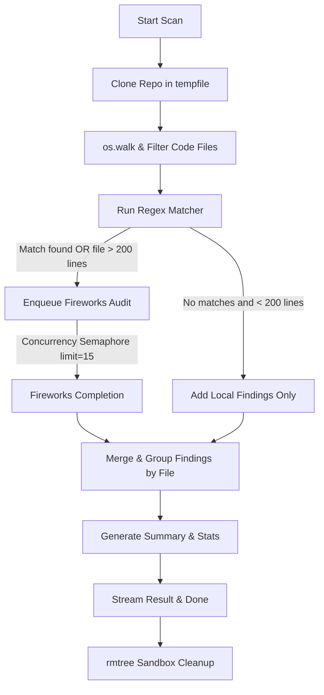

# Feature Guide: Code Scanner

The **Code Scanner** (accessed via the **Code Scanner** tab) performs a deep file-by-file audit of a repository's source code to locate stubs, placeholders, security risks, fake implementations, and coding anti-patterns.

---

## 📖 Feature Overview

* **Purpose**: Audit the source codebase to identify and list issues that traditional linting tools ignore, with a focus on catching AI coding hallucinations and mock structures left in production files.
* **Target Vulnerabilities**:
  * **Hardcoded secrets**: Unprotected API keys, bearer tokens, or database urls.
  * **Placeholder logic**: Unimplemented function structures (`pass`), default TODO comments, and throw-not-implemented blocks.
  * **Hardcoded URLs**: Developer local links (`localhost:8000`) and numeric IP addresses in production.
  * **Fake Successes**: Hardcoded return states (e.g. `return { "success": true }` with no functional body).
  * **Deep static analysis**: AI-discovered structural refactor points and security vulnerabilities.

---

## 🔄 User & Data Workflow

### 1. Scan Trigger
1. The user navigates to `/repo/[owner]/[name]/scan`.
2. The page renders the **CodeScannerClient** component.
3. The user clicks **Start Scan** to trigger the analysis.
4. The client initiates an SSE connection: `POST /api/code-review/analyze`.

### 2. Multi-Stage Execution
1. **Clone & Walk**: The server clones the repository shallowly and collects all files matching common development extensions (e.g. `.py`, `.js`, `.ts`, `.rs`, `.go`, `.cs`, `.java`).
2. **Regex Pipeline**: Runs a local, high-speed regex-based token search on every file.
3. **Semaphore AI Audit**: Files that exceed length limits (> 200 lines) or contain regex hits are enqueued for deep AI audits using Fireworks via Fireworks.
4. **Aggregation**: Results are grouped by file path, and repository-wide statistics are computed.

---

## 💻 Frontend Implementation

### Core Components
* **[CodeScannerClient.jsx](https://github.com/beginningofcoding/slopscanning/blob/main/frontend/src/components/scanner/CodeScannerClient.jsx)**: A comprehensive IDE-like interface.
  * **File Explorer Tree**: A hierarchical folder-file sidebar showing issues counts on badges, and colored indicators based on severity.
  * **Code Viewer Panel**: A panel displaying the contents of the selected file with colored line highlighting representing the exact issue boundaries.
  * **Issue Inspector Drawer**: Shows details on the selected file's findings, highlighting the severity, issue type, detailed explanations, and recommended AI-generated fixes.

---

## ⚙️ Backend Pipeline & Verification Heuristics

The scanner is coordinated inside `services/code_review_service.py` via `analyze_code_review_stream(repo_url)`:



### Local Heuristics & Severity Grading (`pattern_scorer.py`)
Each regex hit is evaluated against `score_match` to calculate a confidence score between `0.0` and `1.0`:
* **Skip Conditions**: Any match located inside a test file (e.g. `*.test.js`, `__tests__/`) or inside `node_modules` is completely ignored (`skip = True`).
* **Score Deductions**:
  * If the file is an example or template: `-0.3`
  * If a variable name contains mock terms (`test`, `demo`, `fake`): `-0.3`
  * If the value is a pure number: `-0.5`
  * If surrounding lines contain environment variable declarations (`process.env`): `-0.4`
* **Score Boosts**:
  * Matches specific API patterns (e.g. `sk-`, `ghp_`): `+0.5`
  * Matches bearer tokens: `+0.5`
* **Action Threshold**: If the final score is **`< 0.4`**, the match is classified as a false positive and skipped.
* **Severity Mapping**: Unlike static setups, regex finding severities are calculated dynamically based on score:
  * `score >= 0.8` -> `high` severity.
  * `score >= 0.6` -> `medium` severity.
  * Otherwise -> `low` severity.

---

## 🧠 AI Prompting & Concurrency Controls

### 1. Deep File Analysis Prompt (Fireworks via Fireworks)
* **Prompt**:
  ```
  You are an expert code reviewer. Analyze the following file: [File Path]
  Return ONLY a JSON array of CodeFinding objects matching this schema:
  [{ 'id': 'unique-string', 'severity': 'critical'|'high'|'medium'|'low', 'type': 'issue-type', 'line': <start-line>, 'endLine': <end-line>, 'snippet': '<code-snippet>', 'explanation': '<why>', 'suggestedFix': '<fix or null>' }]

  Code:
  [File Contents]
  ```

### 2. Concurrency Controls
Calling external LLMs for dozens of code files in parallel will trigger rate ceilings and HTTP timeouts. The service enforces a concurrent task semaphore limit:
```python
# Concurrency limit to prevent hitting Fireworks rate limits
semaphore = asyncio.Semaphore(15)

async def process_file(fp, rp):
    ...
    if num_lines > 200 or len(file_candidates) > 0:
        async with semaphore:
            f_deep_findings = await analyze_file_deep(content, rp)
```
This guarantees that at most `15` concurrent HTTP completions are outstanding at any given time.

---

## ❌ Error & Edge Case Handling

1. **Massive Repositories**: Capped by a max size config (`MAX_REPO_SIZE_MB`, default `200MB`). Files that are excessively large are ignored or truncated, preventing context exhaustions.
2. **Missing API Keys**: If `OPENROUTER_API_KEY` is not set, deep AI audits are skipped, and the scan relies purely on high-speed regex-based scorers, streaming a warning in logs.
3. **Sandbox Cleanup Guarantee**: The temporary sandboxed directories are cleaned up inside a `finally` block using `shutil.rmtree(temp_dir, ignore_errors=True)`, ensuring zero disk leakages even if a process throws an exception or the stream connection drops midway.
