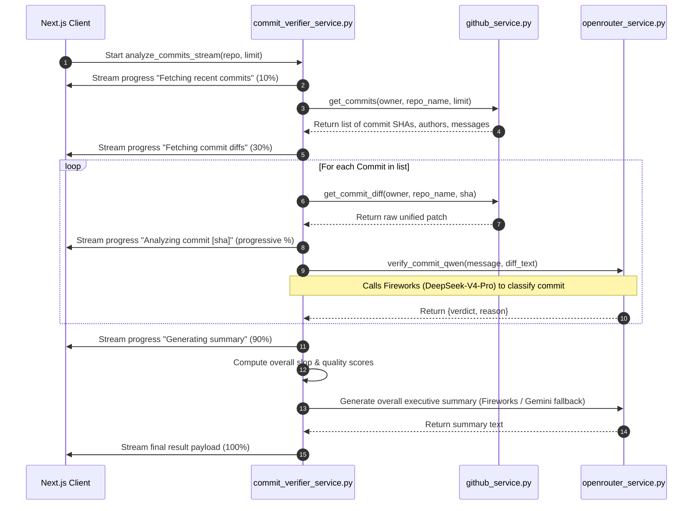

# Feature Guide: Commit Reviewer

The **Commit Reviewer** (accessed via the **Commit Verifier** tab) audits the recent commit history of a repository to ensure commit messages match the code diffs and are not generic or hallucinated.

---

## 📖 Feature Overview

* **Purpose**: Catch AI-generated, lazy, or flat-out incorrect commit messages. Detect over-claiming in commit headers (e.g. claiming to fix a security issue when the changes are just unrelated cosmetic updates).
* **AI Engine**: **Qwen 2.5 72B Instruct** via Fireworks (with a fallback to Gemini 3.1 Flash-Lite).
* **Verdicts**:
  * `TRUSTWORTHY`: The commit message accurately and specifically describes the diff.
  * `GENERIC`: The message is too vague, lazy, or resembles a default AI prompt (e.g. *"Update index.js"*, *"Refactor code"*, *"Fix bug"*) without specific context.
  * `HALLUCINATED`: The message claims to do things that are not present in the diff (e.g. claims *"fixed database leak"* but the diff only updates CSS files).

---

## 🔄 User & Data Workflow

### 1. Verification Request
1. The user navigates to `/repo/[owner]/[name]/commits`.
2. The client renders the **CommitVerifierClient** dashboard.
3. The user can configure the scan depth (defaulting to the **10** most recent commits).
4. The user clicks **Verify Commits** to initiate the audit.

### 2. Live Scan Stream
1. The client opens an SSE connection: `POST /api/commits/analyze` with the payload `{ repo: "owner/name", limit: 10 }`.
2. The server connects to the GitHub API, retrieves the list of commits, and streams step-by-step progress.
3. For each commit, the server fetches the diff and invokes Qwen via Fireworks to analyze it.
4. When finished, the backend generates an executive summary and returns the final payloads.

---

## 💻 Frontend Implementation

### Core Components
* **[CommitVerifierClient.jsx](https://github.com/beginningofcoding/slopscanning/blob/main/frontend/src/components/commits/CommitVerifierClient.jsx)**: The single-page dashboard control center.
  * Displays a configuration panel (depth selector).
  * Shows a progress loader while the SSE connection is streaming.
  * Renders a **Summary Cards Panel** displaying the **Aggregate Slop Score** (0% to 100%) and **Quality Score** (0% to 100%).
  * Displays an **Executive Summary Panel** showing the overall quality analysis.
  * Renders a **Commits List Table**: A detailed list of analyzed commits, showing the SHA link, author, message, verdict badge (green/yellow/red), and the technical explanation for the verdict.

### SSE Stream Management
The component maps progress using the unified `useActionStream` hook:
```javascript
import { useActionStream } from '@/hooks/useActionStream';
import { COMMITS_VERIFY_ANALYZE_URL } from '@/lib/api';

const { start, status, result, lastEvent, error } = useActionStream(COMMITS_VERIFY_ANALYZE_URL);
```
Progress percentages are calculated sequentially: `10%` for fetching commits, `30%` for launching diff audits, and incremental steps (`30%` to `80%`) as each commit SHA is verified.

---

## ⚙️ Backend Pipeline & AI Workflow

The backend streaming operations are managed inside `services/commit_verifier_service.py` via `analyze_commits_stream(repo_url, limit)`:



---

## 🧠 AI Prompting & Data Structures

### 1. Qwen Verification Prompt
* **API Key Config**: Read from `OPENROUTER_API_KEY` (falls back to `GEMINI_API_KEY` if missing).
* **Model ID**: `qwen/qwen-2.5-72b-instruct`
* **Prompt**:
  ```
  You are an expert technical auditor. Analyze the following Git Commit Message and its associated Code Diff. 
  Your job is to detect AI hallucinations, lazy/generic messages, or over-claiming.
  Return ONLY a JSON object matching this schema:
  { "verdict": "TRUSTWORTHY"|"GENERIC"|"HALLUCINATED", "reason": "<short explanation why>" }

  Criteria:
  - TRUSTWORTHY: The message accurately and specifically describes the diff.
  - GENERIC: The message is too vague, lazy, or looks like default AI output (e.g., 'Update index.js', 'Refactor code', 'Fix bug') without specifics.
  - HALLUCINATED: The message claims to do things that are NOT in the diff (e.g. says 'fixed memory leak' but diff only changes CSS).

  Commit Message:
  [Message]

  Code Diff:
  [Diff Text]
  ```

### 2. Output Analysis Schema
The Fireworks service returns a structured dictionary:
```json
{
  "verdict": "GENERIC",
  "reason": "The commit message 'Refactor login' is too vague. The diff specifically updates OAuth scopes and changes token expiry values."
}
```

---

## 🛡️ Scoring Heuristics

The service calculates aggregate metrics across the verified cohort:

$$\text{Slop Score} = \frac{\text{Hallucinated Count} + (\text{Generic Count} \times 0.5)}{\text{Total Commits}}$$

$$\text{Quality Score} = \frac{\text{Trustworthy Count}}{\text{Total Commits}}$$

* **Slop Score**: A higher score (scaled `0.0` to `1.0`) signifies poor hygiene and automated AI spam in logs.
* **Quality Score**: A higher score signifies professional, manual, or highly accurate commit logs.

---

## ❌ Error & Edge Case Handling

1. **Truncation**: If a single commit diff contains massive file changes (e.g. lockfiles or vendor packages), the patch is truncated to `40,000` characters, appending `\n...[truncated]`, ensuring token budgets are respected.
2. **Missing Author Metadata**: If a commit's author field is null (common with manual merges or missing email profiles), the author defaults to `Unknown` to prevent rendering crashes in the frontend commit lists.
3. **Fireworks Rate-Limiting**: In the event that Fireworks times out or reports a quota/rate error, `openrouter_service.py` automatically implements a fallback wrapper to run the same prompt using Gemini, returning the correct evaluation layout.
