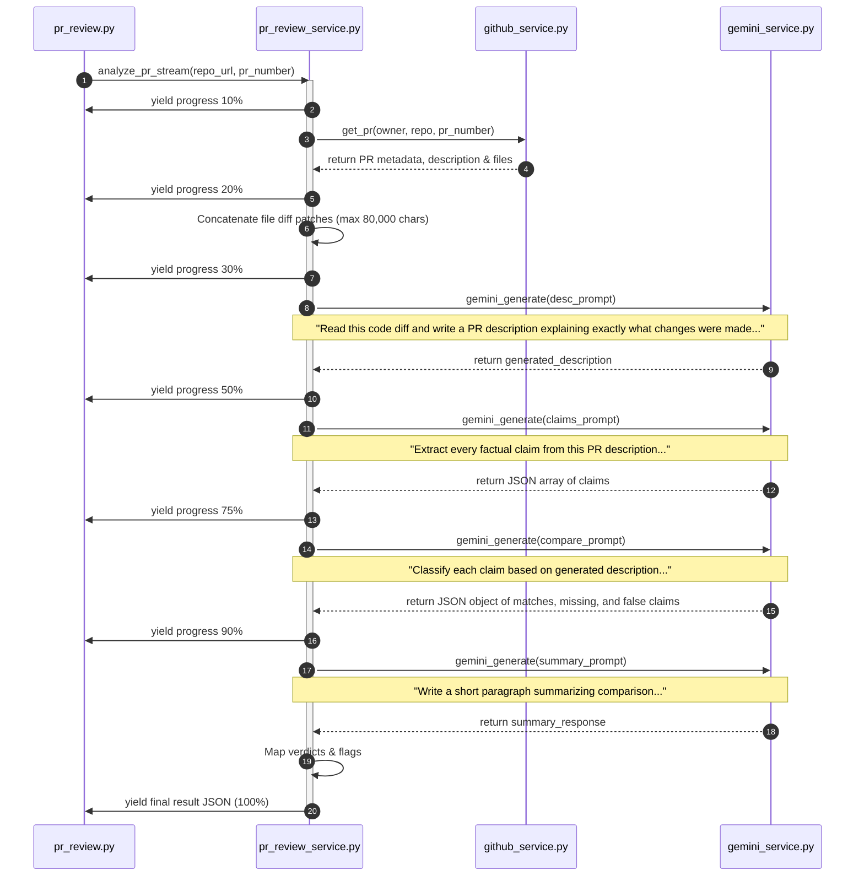

# Feature Guide: PR Reviewer

The **PR Reviewer** is a core engine of the SlopScanning auditor. It verifies the credibility of a pull request by contrasting the claims made in its description against the actual code changes contained inside its diff.

---

## 📖 Feature Overview

* **Purpose**: Catch AI-generated pull request descriptions that claim significant feature updates or bug fixes when the code only implements trivial alterations (e.g. documentation tweaks, comments, or string updates).
* **Target Mismatches**:
  * Description claims major feature logic added, but files are only CSS/Assets.
  * Description claims a bug was fixed, but the diff fingerprint shows no matching logic changes.
  * Description lists multiple new capabilities that have no matching signatures in the changed code.

---

## 🔄 User & Data Workflow

### 1. Selection Phase
1. The user inputs a GitHub URL on the home landing page.
2. The user navigating to the repo dashboard clicks on the **PR Reviewer** card.
3. The application fetches recent pull requests (`GET /github/prs`) and lists them in a filterable list (Open / Closed / Merged).
4. The user clicks on a pull request. The client routes to `/repo/[owner]/[name]/prs/[prNumber]` and fetches detailed PR info (`GET /github/pr/{number}`).

### 2. Review Phase
1. The user reviews the PR's original description, commit list, and files changed.
2. The user clicks the **Review PR** button to trigger the audit.
3. The page initiates a Server-Sent Events (SSE) streaming session with the FastAPI backend (`POST /api/pr-review/analyze`).
4. An interactive timeline shows live progress updates as the backend works.
5. Once complete, the interface shifts to display a verdict dashboard side-by-side with original claims and verified proofs.

---

## 💻 Frontend Implementation

### Core Components
* **[PRListClient.jsx](https://github.com/beginningofcoding/slopscanning/blob/main/frontend/src/components/pr/PRListClient.jsx)**: Renders a list of PRs with filters. Displays PR metadata (author, state, date, number).
* **[PRDetailClient.jsx](https://github.com/beginningofcoding/slopscanning/blob/main/frontend/src/components/pr/PRDetailClient.jsx)**: Core layout wrapper. Manages the overall review state machine. Displays the files tab, commits tab, and progress timeline.
* **[PRReviewPanel.jsx](https://github.com/beginningofcoding/slopscanning/blob/main/frontend/src/components/pr/PRReviewPanel.jsx)**: Renders the final verdict once complete. Features:
  * **Overall Verdict Badge**: Colored based on severity (TRUSTWORTHY, SUSPICIOUS, MISLEADING).
  * **Confidence Gauge**: Displays the system's certainty.
  * **Actual Code Summary**: An AI-generated factual summary of what the code *actually* does.
  * **Interactive Claim Matrix**: Lists each extracted claim with a corresponding label (VERIFIED, UNVERIFIABLE, MISMATCH) and descriptive reasons.
* **[DiffViewer.jsx](https://github.com/beginningofcoding/slopscanning/blob/main/frontend/src/components/pr/DiffViewer.jsx)**: Renders unified diff code patches with syntax highlighting.
* **[ProgressStream.jsx](https://github.com/beginningofcoding/slopscanning/blob/main/frontend/src/components/ui/ProgressStream.jsx)**: Renders the real-time progress bar and log steps.

### Connection & State Management
The streaming sequence is triggered in `PRDetailClient.jsx` by passing the backend analyze URL into the `useActionStream` hook:
```javascript
import { useActionStream } from '@/hooks/useActionStream';
import { PR_REVIEW_ANALYZE_URL } from '@/lib/api';

const { start, status, result, error } = useActionStream(PR_REVIEW_ANALYZE_URL);

// Triggered by "Review PR" click
const handleStartReview = () => {
  start({ repo: `${owner}/${name}`, prNumber: Number(prNumber) });
};
```
The hook reads progressive progress items (`step`, `percent`) and feeds them to the loader. Once `{ type: 'result' }` is parsed, the final details are rendered inside `<PRReviewPanel />`.

---

## ⚙️ Backend Pipeline & AI Workflow

When the client hits `POST /api/pr-review/analyze`, it is handled by `routers/pr_review.py` which returns a streaming `StreamingResponse` from `services/pr_review_service.py`.



---

## 🧠 AI Prompting & Output Structures

The PR reviewer uses three key prompt constructs:

### 1. Claims Extraction Prompt
* **Purpose**: Parse original text description to extract testable, verifiable statements.
* **Prompt**:
  ```
  Extract every factual claim from this PR description as a JSON array of strings. 
  Each claim should be one testable statement. Return ONLY the JSON array.

  [PR Description Content]
  ```
* **Expected JSON Output**:
  ```json
  [
    "Adds token-based JWT authentication middleware.",
    "Refactors the database session connection pool."
  ]
  ```

### 2. Claims Comparison Prompt
* **Purpose**: Compare claims against generated description.
* **Prompt**:
  ```
  Given the generated PR description and the list of original claims, classify each claim. 
  Return ONLY a JSON object matching this schema: { matches: [{claim, evidence, confidence}], missingClaims: [...], falseClaims: [...], partialClaims: [...] }. 
  A claim is 'missing' if the generated description has no evidence for it. 
  A claim is 'false' if the generated description contradicts it. 
  A claim is 'partial' if there is weak supporting evidence.

  Generated Description:
  [Generated Description Content]

  Claims:
  [Extracted Claims JSON]
  ```

---

## 🛡️ Verdict and Scoring Heuristics

The service translates the LLM comparison JSON into a final review result:

1. **Mapping verdicts**:
   * Claims in `matches` are assigned a status of `VERIFIED` with `confidence` mapped to the LLM's returned level.
   * Claims in `partialClaims` are labeled `UNVERIFIABLE` with a default confidence of `0.5`.
   * Claims in `missingClaims` are labeled `MISMATCH` due to "Missing evidence in code" with a confidence of `0.9`.
   * Claims in `falseClaims` are labeled `MISMATCH` due to "Contradictory evidence" with a confidence of `0.9`.
2. **Determining Overall Verdict**:
   * If any **false claims** are detected: Verdict = `MISLEADING`, Confidence Score = `0.9`.
   * If **missing** or **partial** claims are found: Verdict = `SUSPICIOUS`, Confidence Score = `0.7`.
   * If all claims match: Verdict = `TRUSTWORTHY`, Confidence Score = `0.85`.

---

## ❌ Error & Edge Case Handling

1. **Truncation limits**: Extremely large pull request diffs can exceed token limits. The backend handles this by scanning files and capping the parsed unified diff at `80,000` characters, logging a truncation warning rather than failing.
2. **Missing PR Descriptions**: If a PR contains an empty description body, the pipeline bypasses claims extraction and comparison, setting the verdict to `TRUSTWORTHY` and generating a warning note indicating: *"No PR description was provided, so no claims could be verified."*
3. **JSON Extraction fallbacks**: In case Gemini's structured response contains invalid markdown wrapping or syntax, the backend uses `_safe_json_parse` to clean fences and handles decodes gracefully, returning safe empty arrays (`[]`) to avoid crashing the stream.
