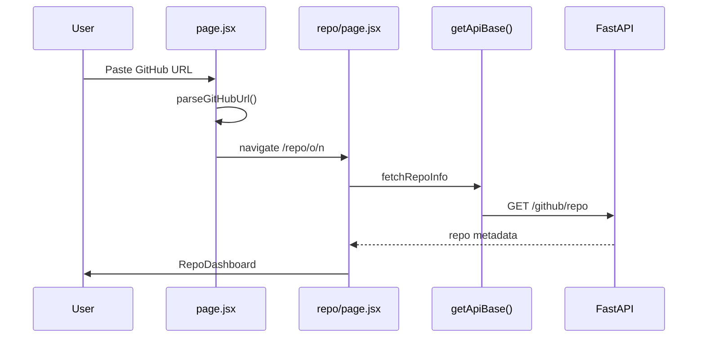
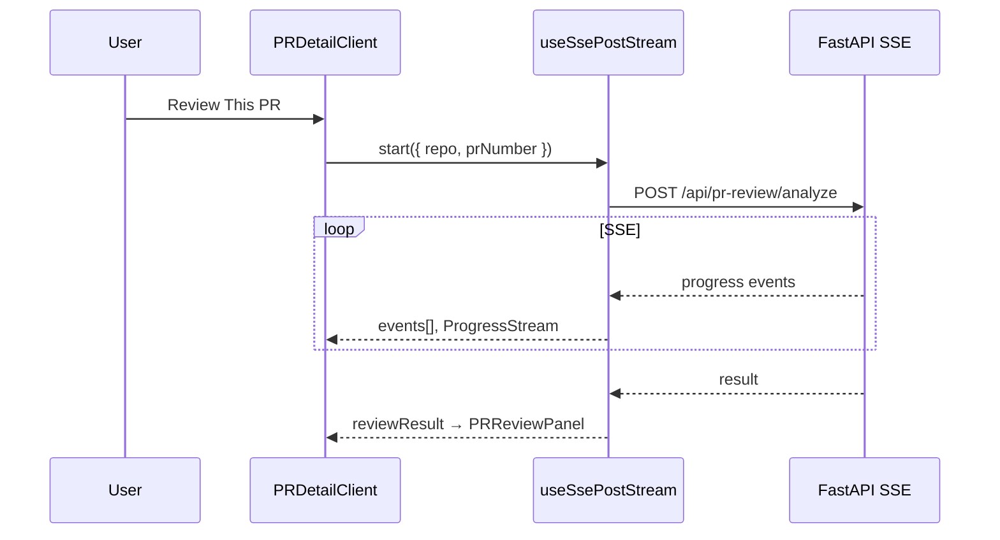

# SlopScanning Frontend — Complete Technical Documentation

> **Product:** SlopScanning — AI code quality detector for GitHub repositories  
> **Stack:** Next.js 16 (App Router) · React 18 · Tailwind CSS 4 · Inline styles + CSS variables  
> **Backend:** FastAPI on Render (`https://slopscanning.onrender.com`)  
> **Deploy:** Vercel (`frontend/` root directory)

---

## Table of contents

1. [Product positioning & UX narrative](#1-product-positioning--ux-narrative)
2. [Technology stack](#2-technology-stack)
3. [Directory structure](#3-directory-structure)
4. [Theme, design tokens & visual positioning](#4-theme-design-tokens--visual-positioning)
5. [Layout & spatial positioning](#5-layout--spatial-positioning)
6. [Routing (App Router)](#6-routing-app-router)
7. [API layer & network architecture](#7-api-layer--network-architecture)
8. [Hooks & shared libraries](#8-hooks--shared-libraries)
9. [Page files (`src/app`)](#9-page-files-srcapp)
10. [Components — full file reference](#10-components--full-file-reference)
11. [User flows & data flow](#11-user-flows--data-flow)
12. [Environment variables & deployment](#12-environment-variables--deployment)

---

## 1. Product positioning & UX narrative

### What the frontend is for

The frontend is a **zero-trust GitHub auditor UI** built for the Slop Scan hackathon. It answers:

> **Did a human actually check this before publish?**

It does **not** position itself as a generic “AI authorship detector.” Instead it surfaces **evidence-based signals** across four pillars:

| Pillar | UI entry | User action |
|--------|----------|-------------|
| **Full repository audit** | `/repo/{owner}/{name}/audit` | One-click cross-pillar heuristic scan + optional maintainer brief |
| **PR Reviewer** | `/repo/.../pr-review` → PR detail | Compare PR description vs diff; claim verification |
| **Commit Verifier** | `/repo/.../commits` | Flag generic / hallucinated commit messages |
| **Docs Verifier** | `/repo/.../docs` | Markdown quality, concreteness, drift |
| **Code Scanner** | `/repo/.../code-review` | Regex + deep LLM file audit, IDE-style UI |

### Brand & tone

- **Visual identity:** “Red Scan” dark theme — void black background, scan-red accent (`#ff1a1a`), CRT grid overlay, radar motifs.
- **Typography:** Inter (UI) + JetBrains Mono (URLs, terminal, badges).
- **Motion:** Boot overlay on homepage; scan-line animations; `prefers-reduced-motion` respected.
- **Copy:** Direct, security-audit tone (“INITIALIZING SCAN”, “Detect slop before it ships”).

### Information architecture

```
/  (landing: paste URL → navigate to repo)
└── /repo/[owner]/[name]  (dashboard: 5 module cards)
    ├── /audit   (unified SSE audit)
    ├── /pr-review     (list → /pr-review/[prNumber])
    ├── /commits (list + SSE verify)
    ├── /docs    (file list + SSE verify)
    └── /code-review    (IDE scanner + SSE)
```

---

## 2. Technology stack

| Layer | Choice | Role |
|-------|--------|------|
| Framework | Next.js 16.2.6 | App Router, RSC + client components |
| UI | React 18.3 | Components, hooks |
| Styling | Tailwind 4 (`@import "tailwindcss"`) + **CSS variables** in `globals.css` | Theme tokens; most layout uses **inline `style={{}}`** |
| Icons | `lucide-react` | Consistent icon set |
| Dates | `date-fns` | Relative PR timestamps |
| Markdown | `react-markdown`, `remark-gfm`, `rehype-raw` | Docs viewer, summaries |
| Diff | `diff` (package) | Available for diff utilities |
| Syntax | `react-syntax-highlighter` | Code highlighting in scanner |
| Class names | `clsx` | Conditional classes (sparse use) |

### Scripts (`package.json`)

| Script | Command | Purpose |
|--------|---------|---------|
| `dev` | `next dev` | Local development |
| `build` | `next build` | Production build |
| `start` | `next start` | Production server |
| `lint` | `next lint` | ESLint |

### Path alias (`jsconfig.json`)

```json
"@/*" → "./src/*"
```

Example: `@/lib/api` → `frontend/src/lib/api.js`

---

## 3. Directory structure

```
frontend/
├── Dockerfile                 # Production Node image (npm ci, build, start)
├── eslint.config.mjs
├── jsconfig.json              # @/* path alias
├── next.config.mjs            # Turbopack root, image domains, API proxy rewrites
├── package.json
├── postcss.config.mjs
├── public/
│   └── favicon.svg            # Brand favicon (matches Logo.jsx motif)
├── FRONTEND_DOCUMENTATION.md  # This file
├── .env.example               # API_URL / NEXT_PUBLIC_API_URL
└── src/
    ├── app/                   # Next.js App Router (routes + layouts)
    │   ├── layout.jsx         # Root layout, metadata, AppShell
    │   ├── page.jsx           # Homepage (client)
    │   ├── globals.css        # Design system + animations
    │   ├── favicon.ico
    │   └── repo/[owner]/[name]/
    │       ├── page.jsx           # Repo dashboard
    │       ├── audit/page.jsx
    │       ├── commits/page.jsx
    │       ├── docs/page.jsx
    │       ├── scan/page.jsx
    │       └── prs/
    │           ├── page.jsx
    │           └── [prNumber]/page.jsx
    ├── components/
    │   ├── audit/             # Unified audit UI
    │   ├── commits/           # Commit verifier client
    │   ├── docs/              # Docs verifier client
    │   ├── landing/           # Boot overlay, feature deep dive
    │   ├── layout/            # AppShell (grid + CRT)
    │   ├── pr/                # PR list, detail, review, diff
    │   ├── repo/              # RepoNav, RepoDashboard
    │   ├── scanner/           # Code scanner IDE
    │   ├── shared/            # SignalsPanel
    │   └── ui/                # Design system primitives
    ├── constants.js           # Re-export from lib/constants
    ├── hooks/
    │   └── useSsePostStream.js # SSE consumer for POST streams
    └── lib/
        ├── api.js             # REST + SSE URL helpers
        ├── constants.js       # Verdict/severity/stage labels
        ├── github.js          # URL parsing helpers
        ├── liveFirePresets.js
        └── project.js         # PROJECT_NAME, author, GitHub URL
```

---

## 4. Theme, design tokens & visual positioning

**Source file:** `src/app/globals.css` (lines 1–516)

### 4.1 Color philosophy — “Red Scan dark”

| Token | Value | Usage |
|-------|-------|--------|
| `--bg-void` | `#050505` | Page background |
| `--bg-primary` | `#0a0a0a` | Cards, surfaces |
| `--bg-secondary` | `#111111` | Inputs, secondary panels |
| `--bg-surface` | `#1a1a1a` | Elevated surfaces |
| `--scan-red` | `#ff1a1a` | Primary accent, CTAs, active nav |
| `--health-green` | `#00e676` | Trust / success / audit highlight |
| `--warning-amber` | `#ffab00` | Suspicious / medium severity |
| `--critical-red` | `#ff1744` | Errors, critical findings |
| `--info-blue` | `#448aff` | Code scanner pillar |
| `--purple` | `#b388ff` | Commits pillar |
| `--text-primary` | `#f0f0f0` | Headings, body |
| `--text-secondary` | `#888888` | Descriptions |
| `--text-muted` | `#555555` | Meta, labels |

**Legacy aliases** (lines 63–89): `--color-accent`, `--color-surface`, `--color-green`, etc. — used interchangeably in older components.

### 4.2 Typography

| Token | Font |
|-------|------|
| `--font-display` | Inter |
| `--font-mono` | JetBrains Mono |

Classes: `.mono`, `.hero-logo-gradient` (red gradient text on “slop” headline).

### 4.3 Radius & motion

| Token | Value |
|-------|-------|
| `--radius-sm` … `--radius-xl` | 8px → 24px |
| `--transition-fast/normal/slow` | 0.15s / 0.3s / 0.5s |

**Keyframes:** `scanLine`, `bootBar`, `heartbeat`, `radar-sweep`, `fade-in-up`, `shimmer`, `glow-pulse`, etc.

### 4.4 Global overlays (position: fixed)

| Class | z-index | Position | Purpose |
|-------|---------|----------|---------|
| `.grid-bg` | 0 | `inset: 0` | Red grid + radial vignette |
| `.crt-scanline` | 1 | `inset: 0` | CRT scanline texture |
| AppShell content | 2 | relative | All page content above overlays |

### 4.5 Component utility classes

| Class | Purpose |
|-------|---------|
| `.glass-card` / `.card` | Frosted card, red border glow on hover |
| `.terminal` | Monospace dark panel (landing mocks) |
| `.badge-*` | Severity chips (critical/high/medium/low/info) |
| `.btn-scan-primary` | Red CTA button |
| `.input-mri` | Monospace input with red focus ring |
| `.scan-line-overlay` | Animated horizontal scan line (loading) |
| `.boot-bar-track` / `.boot-bar-fill` | Boot progress bar |

### 4.6 Pillar color mapping (`RepoDashboard.jsx`)

| Module key | Icon color token | Background RGBA |
|------------|------------------|-----------------|
| `audit` | `--health-green` | green 12% |
| `prs` | `--scan-red` | red 12% |
| `commits` | `--purple` | purple 12% |
| `docs` | `--warning-amber` | amber 12% |
| `scan` | `--info-blue` | blue 12% |

---

## 5. Layout & spatial positioning

### 5.1 Global shell (`AppShell.jsx`)

```
┌─────────────────────────────────────────────┐
│  grid-bg (fixed, full viewport)             │
│  crt-scanline (fixed)                       │
│  ┌───────────────────────────────────────┐  │
│  │  children (z-index: 2)                │  │
│  │  min-height: 100vh                    │  │
│  └───────────────────────────────────────┘  │
└─────────────────────────────────────────────┘
```

- **Function:** `AppShell({ children, showGrid = true })` — wraps every page via `layout.jsx`.

### 5.2 Homepage (`page.jsx`) layout zones

| Zone | Position | max-width | Notes |
|------|----------|-----------|-------|
| Radar decoration | `fixed`, top-right | 520px | `ScannerRadarIcon`, pointer-events none |
| Gradient orbs | `fixed`, multiple | 300–500px | `animate-float`, blur 40px |
| Nav | flow | 1200px centered | Logo + GitHub link |
| Hero | flow | 780px centered | Badge, H1, form, examples |
| Feature cards | grid | 960px | `repeat(auto-fit, minmax(220px, 1fr))` |
| FeatureDeepDive | full width section | — | Below cards |
| How it works | 4-column grid | 960px | Numbered steps |
| Tech strip | footer area | 960px | Pill badges |
| Footer | centered | — | Author links |

### 5.3 Repo-scoped layout pattern

Most repo routes share:

```
┌──────────────────────────────────────────────┐
│ RepoNav (sticky top, z-index 50, h=52px)     │
├──────────────────────────────────────────────┤
│ Content area                                 │
│   max-width: 1000–1400px (varies by page)    │
│   margin: 0 auto                             │
│   padding: 2rem 1.5rem                       │
└──────────────────────────────────────────────┘
```

| Page | Content max-width |
|------|-------------------|
| Dashboard | 1000px |
| PR list / detail | 1200px |
| Commits / docs | 1400px |
| Audit | 1000px (inside RepoAuditClient) |
| Code scan | Full width flex (tree + editor) |

### 5.4 RepoNav (`RepoNav.jsx`) internal layout

- **Row:** `display: flex`, `height: 52px`, `padding: 0 1.5rem`
- **Left:** Home link (Logo + PROJECT_NAME)
- **Breadcrumb:** `owner/name` in mono red
- **Tabs:** Full Audit | PR | Commits | Docs | Scan — active tab = red text + 2px bottom border

---

## 6. Routing (App Router)

Next.js 16 App Router — all routes under `src/app/`.

### 6.1 Route table

| URL path | File | RSC / Client | Purpose |
|----------|------|--------------|---------|
| `/` | `app/page.jsx` | **Client** (`'use client'`) | Landing, URL input, boot overlay |
| `/repo/[owner]/[name]` | `app/repo/[owner]/[name]/page.jsx` | **Server** + Suspense | Fetch repo metadata → dashboard |
| `/repo/[owner]/[name]/audit` | `.../audit/page.jsx` | **Server** shell + **Client** audit | Unified audit; `?demo=1` auto-starts |
| `/repo/[owner]/[name]/pr-review` | `.../pr-review/page.jsx` | **Server** + Client list | PR list from API |
| `/repo/[owner]/[name]/pr-review/[prNumber]` | `.../pr-review/[prNumber]/page.jsx` | **Server** + Client detail | PR diff + SSE review |
| `/repo/[owner]/[name]/commits` | `.../commits/page.jsx` | **Server** + Client | Initial commits + SSE verify |
| `/repo/[owner]/[name]/docs` | `.../docs/page.jsx` | **Server** + Client | Doc file list + SSE verify |
| `/repo/[owner]/[name]/code-review` | `.../code-review/page.jsx` | **Server** shell + Client scanner | Code scan (no SSR data fetch) |

### 6.2 Dynamic segments

- `[owner]` — GitHub user or org login (case-sensitive as GitHub expects)
- `[name]` — Repository name
- `[prNumber]` — Pull request number (string in URL, used as number in API)

### 6.3 Query parameters

| Route | Param | Effect |
|-------|-------|--------|
| `/repo/.../audit` | `demo=1` | `RepoAuditClient` `autoStart={true}` — runs audit on mount (Live Fire) |

### 6.4 Metadata

- **Root:** `layout.jsx` — OG/Twitter tags, `theme-color: #050505`
- **Repo pages:** `generateMetadata({ params })` → title `{owner}/{name} — SlopScanning`

### 6.5 Proxy rewrite (`next.config.mjs`)

| Browser path | Proxied to |
|--------------|------------|
| `/api/backend/:path*` | `{API_URL or NEXT_PUBLIC_API_URL or default Render}/:path*` |

Used when `NEXT_PUBLIC_API_URL` is unset in browser — same-origin proxy avoids CORS during misconfiguration.

---

## 7. API layer & network architecture

**Source:** `src/lib/api.js`

### 7.1 Base URL resolution — `getApiBase()`

| Runtime | Logic |
|---------|--------|
| **Browser** | If `NEXT_PUBLIC_API_URL` set and not localhost → use it; else `{origin}/api/backend` |
| **Server (RSC)** | `API_URL` → `NEXT_PUBLIC_API_URL` → `RENDER_EXTERNAL_URL` → fallback `http://localhost:8000` |

### 7.2 REST endpoints (via `apiFetch`)

All requests: `Content-Type: application/json`. Errors throw `ApiError` with formatted message.

| Function | Method | Path | Query/body | Cache (Next) | Used by |
|----------|--------|------|------------|--------------|---------|
| `fetchRepoInfo(owner, name)` | GET | `/github/repo` | `owner`, `name` | `revalidate: 300` | Repo dashboard |
| `fetchPRList(owner, name, state?)` | GET | `/github/prs` | `owner`, `name`, `state` (default `all`) | 60s | PR list page |
| `fetchPRDetail(owner, name, prNumber)` | GET | `/github/pr/{prNumber}` | `owner`, `name` | 60s | PR detail page |
| `fetchCommitsList(owner, name, limit?)` | GET | `/github/commits` | `owner`, `name`, `limit` (default 10) | 60s | Commits page |
| `fetchDocsList(owner, name)` | GET | `/github/docs` | `owner`, `name` | 60s | Docs page |
| `fetchRepoFileContent(owner, name, filePath)` | GET | `/github/file` | `owner`, `name`, `path` | none | Code scanner |
| `fetchCodeReviewSummary(repoUrl, findings)` | POST | `/api/code-review/summary` | `{ repo, findings }` | none | Code scanner (post-scan) |

#### Expected response shapes (from backend)

**`fetchRepoInfo` →**
```json
{
  "owner", "name", "description", "stars", "forks",
  "language", "default_branch", "github_id", "size_kb"
}
```

**`fetchPRList` →** array of `{ number, title, state, merged, user, created_at, labels }`

**`fetchPRDetail` →** `{ number, title, body, state, merged, user, created_at, files[], commits[], comments[], additions, deletions, changed_files }`

**`fetchCommitsList` →** array of `{ sha, message, author, date, ... }`

**`fetchDocsList` →** array of `{ path, size }`

### 7.3 SSE endpoints (POST + `text/event-stream`)

Resolved at **call time** via getter functions (not build-time constants):

| Getter | Path | Typical POST body | Consumer |
|--------|------|-------------------|----------|
| `getPrReviewAnalyzeUrl()` | `/api/pr-review/analyze` | `{ repo, prNumber }` | `PRDetailClient` |
| `getDocsAnalyzeUrl()` | `/api/docs/analyze` | `{ repo, ... }` | `DocsReviewClient` |
| `getCodeReviewAnalyzeUrl()` | `/api/code-review/analyze` | `{ repo, ... }` | `CodeReviewClient` |
| `getCommitsAnalyzeUrl()` | `/api/commits/analyze` | `{ repo, limit }` | `CommitsReviewClient` |
| `getRepoAuditAnalyzeUrl()` | `/api/repo/audit` | `{ repo, mode: 'fast' }` | `RepoAuditClient` |

#### SSE event protocol (`useSsePostStream`)

| `data.type` | Fields | UI effect |
|-------------|--------|-----------|
| `progress` | `step`, `percent`, optional `message` | Append to `events[]`; `ProgressStream` renders |
| `result` | `data` (payload) | `setResult({ data })` |
| `error` | `message` | `setError`, `status: 'error'` |

**Hook state:** `idle` | `streaming` | `complete` | `error`

### 7.4 Error formatting — `formatApiError()`

| Condition | User-facing message |
|-----------|---------------------|
| Bare `Not Found` / 404 without GitHub detail | Misconfigured Vercel API URL hint |
| GitHub 404 in detail | Repo not found / private repo hint |
| `ECONNREFUSED` / Failed to fetch | Cannot reach API |

---

## 8. Hooks & shared libraries

### 8.1 `hooks/useSsePostStream.js`

| Export | Type | Purpose |
|--------|------|---------|
| `useSsePostStream(url)` | React hook | POST SSE stream parser |

**Returns:** `{ events, lastEvent, result, status, error, start, abort }`

| Function | Purpose |
|----------|---------|
| `start(payload)` | POST JSON body, read stream, parse `data: {...}\n\n` chunks |
| `abort()` | AbortController cancel |

### 8.2 `lib/github.js`

| Function | Purpose |
|----------|---------|
| `parseGitHubUrl(input)` | Normalize URL → `{ owner, name }` or `null` |
| `buildRepoUrl(owner, name)` | `https://github.com/owner/name` |
| `buildPRUrl(owner, name, prNumber)` | PR HTML URL |

### 8.3 `lib/project.js`

| Export | Value |
|--------|-------|
| `PROJECT_NAME` | `SlopScanning` |
| `PROJECT_AUTHOR` | `thanos` |
| `PROJECT_GITHUB_URL` | `https://github.com/beginningofcoding/slopscanning` |

### 8.4 `lib/liveFirePresets.js`

| Export | Purpose |
|--------|---------|
| `LIVE_FIRE_PRESETS` | Demo repo URLs for homepage |
| `parseOwnerName(url)` | Extract owner/name from URL tail |
| `auditPathForUrl(url, demo)` | → `/repo/{owner}/{name}/audit?demo=1` |

### 8.5 `lib/constants.js` / `constants.js`

| Constant group | Used for |
|----------------|----------|
| `PR_STATES` | PR list badges |
| `VERDICT_COLORS`, `VERDICT_BG` | PR review verdict styling |
| `CLAIM_VERDICT_COLORS` | Per-claim rows |
| `PROGRESS_STAGE_LABELS` | SSE step human labels |
| `SEVERITY_COLORS`, `SEVERITY_BG` | Code scanner |
| `FINDING_TYPE_LABELS`, `FINDING_TYPE_COLORS` | Issue grouping |

---

## 9. Page files (`src/app`)

### 9.1 `layout.jsx`

| Item | Detail |
|------|--------|
| **Exports** | `metadata` (SEO), default `RootLayout` |
| **Wraps** | `<html>` → `<body>` → `<AppShell>{children}</AppShell>` |
| **Fonts** | Google Fonts preconnect for Inter + JetBrains Mono (also loaded in CSS) |

### 9.2 `page.jsx` (Homepage)

| Function / symbol | Purpose |
|-------------------|---------|
| `HomePage` (default) | Main landing component |
| `handleSubmit` | `parseGitHubUrl` → `router.push(/repo/owner/name)` |
| `handleExample` | Fill input with preset URL |
| `handleLiveFire` | Navigate to audit path with `demo=1` |
| `FEATURES`, `STEPS`, `TECH`, `EXAMPLES` | Static marketing data |

**State:** `bootDone`, `url`, `error`, `loading`, `inputFocused`

**Flow:** Show `BootOverlay` until complete → hero + form + FeatureDeepDive + steps + footer.

### 9.3 `repo/[owner]/[name]/page.jsx`

| Function | Purpose |
|----------|---------|
| `generateMetadata` | Dynamic page title |
| `RepoContent` (async) | Server: `fetchRepoInfo` → dashboard or `ErrorState` |
| `RepoPage` (default) | Suspense + `LoadingSpinner` |

### 9.4 `audit/page.jsx`

| Function | Purpose |
|----------|---------|
| `AuditPage` | Renders `RepoNav` + `RepoAuditClient`; reads `searchParams.demo` |

### 9.5 `prs/page.jsx` & `prs/[prNumber]/page.jsx`

Server-fetch PR list or detail → client components with `RepoNav`.

### 9.6 `commits/page.jsx` & `docs/page.jsx`

Server-fetch initial list → pass as `initialCommits` / `initialDocs` to client verifiers.

### 9.7 `scan/page.jsx`

No server data fetch — `CodeReviewClient` loads everything client-side after scan.

---

## 10. Components — full file reference

### 10.1 Layout

#### `components/layout/AppShell.jsx`

| Function | Line | Purpose |
|----------|------|---------|
| `AppShell` | 1 | Optional grid + CRT overlays; children at z-index 2 |

---

### 10.2 Repo

#### `components/repo/RepoNav.jsx` (client)

| Symbol | Purpose |
|--------|---------|
| `TABS` | Tab config: audit, prs, commits, docs, scan |
| `RepoNav({ owner, name, active })` | Sticky nav; `active` highlights current tab |

#### `components/repo/RepoDashboard.jsx` (client)

| Symbol | Purpose |
|--------|---------|
| `MODULE_ICONS` | Color map per module |
| `RepoDashboard({ repoInfo, owner, name })` | Repo header (stars, language) + 5 module cards |

---

### 10.3 Landing

#### `components/landing/BootOverlay.jsx` (client)

| Function | Purpose |
|----------|---------|
| `BootOverlay({ onComplete })` | Animated intro; skip on click/Enter/Escape |
| `finish` | Calls `onComplete` after animation |

#### `components/landing/FeatureDeepDive.jsx`

| Function | Purpose |
|----------|---------|
| `MockBadge` | Severity pill for mock terminal |
| `MockTerminal` | Fake scan output lines |
| `FeatureDeepDive` | Four-column “what we detect” section |

---

### 10.4 UI primitives (`components/ui/`)

| File | Export | Purpose |
|------|--------|---------|
| `Badge.jsx` | `Badge` | Colored label chip |
| `Button.jsx` | `Button` | primary/secondary/ghost + loading |
| `Card.jsx` | `Card` | glass-card wrapper |
| `EmptyState.jsx` | `EmptyState` | Icon + message + optional action |
| `ErrorState.jsx` | `ErrorState` | Centered error; subtitle; Back to home |
| `LoadingScreen.jsx` | `LoadingScreen` | Spinner + scan line + boot bar |
| `LoadingSpinner.jsx` | `LoadingSpinner` | Alias → LoadingScreen |
| `Logo.jsx` | `Logo` | SVG brand mark |
| `ProgressStream.jsx` | `ProgressStream` | SSE progress checklist + % bar |
| `ScannerRadarIcon.jsx` | `ScannerRadarIcon` | Large decorative radar SVG |

---

### 10.5 PR (`components/pr-review/`)

| File | Key functions | Purpose |
|------|---------------|---------|
| `DiffViewer.jsx` | `DiffLine`, `FileDiff`, `DiffViewer` | Collapsible per-file patches |
| `PRListClient.jsx` | `PRStateIcon`, `PRListClient` | Filter/search PR table |
| `PRDetailClient.jsx` | `PRDetailClient`, `handleReview` | Tabs: diff, commits, comments, progress, review |
| `PRReviewPanel.jsx` | `VerdictIcon`, `ClaimRow`, `PRReviewPanel` | Verdict + claims list + signals tab |
| `PRSignalsPanel.jsx` | `PRSignalsPanel` | PR-specific metrics + SignalsPanel |
| `ProgressStream.jsx` | re-export | → `ui/ProgressStream` |

**PRDetailClient tabs (positional order in UI):**

1. Changed Files (diff)
2. Commits
3. Comments
4. Analysis (when streaming)
5. Review Result (when `reviewResult` set)

---

### 10.6 Commits

#### `components/commits/CommitsReviewClient.jsx`

| Function | Purpose |
|----------|---------|
| `SlopScoreBar` | Horizontal score meter |
| `CommitsReviewClient` | Sidebar commit list + detail + SSE analyze |
| `handleVerify` | `start({ repo, limit: 10 })` |

**Layout:** Header row (title + Analyze button) → progress → two-column (commit list | selected commit analysis).

---

### 10.7 Docs

#### `components/docs/DocsReviewClient.jsx`

| Function | Purpose |
|----------|---------|
| `SlopScoreBar` | Score display |
| `HighlightedMarkdown` | Renders MD; highlights finding line ranges |
| `DocsReviewClient` | File list, viewer, findings, SSE analyze |
| `loadContent` | `fetchRepoFileContent` for selected doc |
| `handleVerify` | Starts docs SSE pipeline |

**Layout:** Three-column feel — doc list (left) | content (center) | findings (right).

---

### 10.8 Scanner

| File | Key functions | Purpose |
|------|---------------|---------|
| `CodeReviewClient.jsx` | `buildTree`, `TreeNode`, `CodeViewer`, `AISummaryPanel`, `handleScan`, `handleSelectFile`, `handleJumpToIssue` | Full IDE layout |
| `GroupedIssuePanel.jsx` | `SeverityIcon`, `IssueRow`, `GroupHeader`, `toggleGroup` | Tabbed issue groups |
| `SeverityDistribution.jsx` | `SeverityDistribution` | Clickable severity bar chart |

**Code scanner layout (approximate):**

```
┌────────────┬─────────────────────────────┐
│ File tree  │  Code viewer (highlighted)  │
│ (left)     │                             │
├────────────┴─────────────────────────────┤
│ SeverityDistribution + GroupedIssuePanel │
│ AISummaryPanel (after scan)              │
└──────────────────────────────────────────┘
```

---

### 10.9 Audit

| File | Functions | Purpose |
|------|-----------|---------|
| `RepoAuditClient.jsx` | `SlopGauge`, `RepoAuditClient` | Full audit UI + autoStart |
| `LimitationsPanel.jsx` | `LimitationsPanel` | Bullet list of audit caveats |

**Result layout (top → bottom):**

1. Slop Index + Unchecked Publish Index gauges (grid)
2. Pillar scores (4 columns: pr, commits, docs, code)
3. Maintainer brief (pre-wrap text)
4. `SignalsPanel`
5. `LimitationsPanel`

---

### 10.10 Shared

#### `components/shared/SignalsPanel.jsx`

| Prop | Purpose |
|------|---------|
| `signals` | Array of `{ id, pillar, severity, title, score, evidence, ... }` |

Renders cards with severity `Badge`, pillar tag, score %, evidence monospace block.

---

## 11. User flows & data flow

### 11.1 Enter repository



### 11.2 Run PR review (client-only after SSR)



### 11.3 Live Fire demo

1. Homepage → “Live Fire demo” → `auditPathForUrl` → `/repo/.../audit?demo=1`
2. `RepoAuditClient` `useEffect` calls `start({ repo, mode: 'fast' })` on mount

---

## 12. Environment variables & deployment

### 12.1 Required for production (Vercel)

| Variable | Scope | Purpose |
|----------|-------|---------|
| `NEXT_PUBLIC_API_URL` | Build + browser | Direct API calls (e.g. `https://slopscanning.onrender.com`) |
| `API_URL` | Server RSC | SSR fetch to Render |

### 12.2 Local development (`frontend/.env.local`)

```env
NEXT_PUBLIC_API_URL=http://localhost:8000
API_URL=http://localhost:8000
```

### 12.3 Docker (`frontend/Dockerfile`)

- `npm ci` → `npm run build` with `NEXT_PUBLIC_API_URL` build arg
- `CMD npm start` on port 3000

### 12.4 Config files summary

| File | Role |
|------|------|
| `next.config.mjs` | Turbopack root, `optimizePackageImports: lucide-react`, image domains, `/api/backend` rewrite |
| `postcss.config.mjs` | Tailwind 4 PostCSS |
| `eslint.config.mjs` | Lint rules |

---

## Appendix A — File count summary

| Area | Files |
|------|-------|
| App routes | 8 pages + layout + globals |
| Components | 27 JSX files |
| Lib / hooks | 6 modules |
| Public | favicon.svg |

---

## Appendix B — External dependencies on backend

The frontend assumes a running FastAPI backend with:

- CORS allowing the Vercel origin (`CORS_ORIGINS` on Render)
- Redis + GitHub token configured
- Fireworks/Gemini for LLM-backed analyzers

Health check: `GET /health` → `{ status: "ok", service: "slopscanning", ... }`

---

*Generated for SlopScanning `frontend/` — maintain this doc when adding routes, API methods, or design tokens.*
